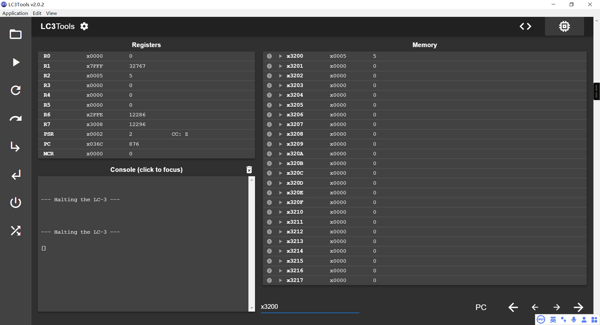
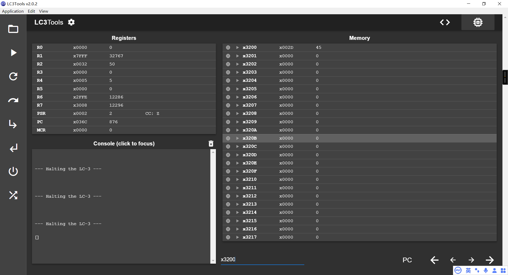
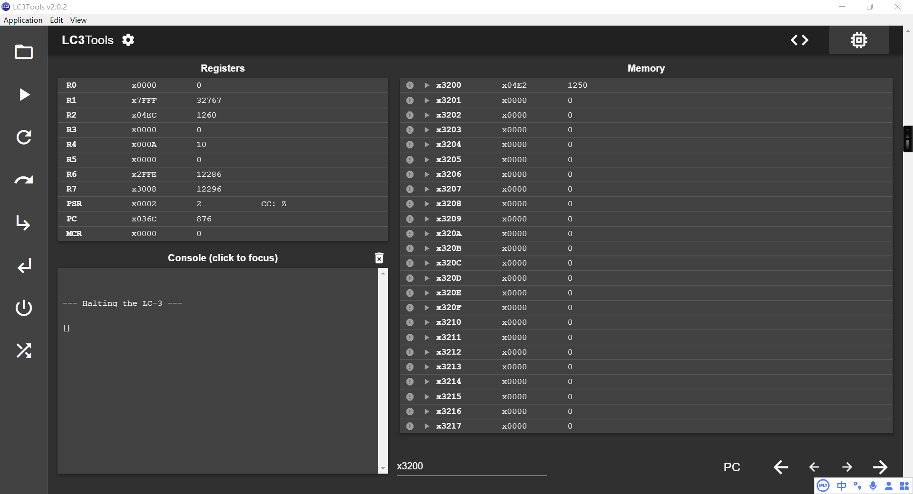

### Lab4

- 姓名：林佳胜；学号：PB24511997

---

> 我感觉之前实验报告的要求还好，本实验的实验报告要求多少有点儿意义不明/fad
>
> 源文件的注释还算详细。

#### 一. 实验目的

> 此为吐槽：我不明白为什么这个报告会有这一小节（感觉是写任务简介，以及不应该助教写么？）

- 本实验的主要目的是通过 **LC3** 的汇编语言实现一个复杂的递归算法，模拟派送路线的推荐值计算（类似如下代码的转译）。

``` python
def rececursive_for_routes(N: int, M: int):
    if (N == 0 or M == 0):
        return 1
    return rececursive_for_routes(N-1, M) + rececursive_for_routes(N, M-1)

def calculate_recommendations(N: int=0, M: int=0):
    steps = N + M
    routes = rececursive_for_routes(N, M)
    return 5 * routes - steps
```

- 通过完成该实验，帮助完成实验的同学理解以下知识点：
    - **LC3** 的递归实现：掌握如何通过手动维护 `栈（Stack）` 和 `帧指针（Frame Pointer）` ，来处理嵌套函数（尤递归）的调用。

#### 二. 开发过程与问题解决

##### 2.1 开发步骤

1. 理解问题需求（抽象化）
    - 对于任意的 **Input_N** 、**Input_M** 实现以下函数：
        - $Steps(N,M)=N+M,\quad N\geq0,M\geq0$
        - $Routes(N,M)=\begin{cases}1,&N=0\text{ or }M=0\\Routes(N-1,M)+Routes(N,M-1),&N>0\text{ and }M>0\end{cases}$
        - $Recommendation(N,M)=Routes(N,M)\times5-Steps(N,M)$
    - 其中 **Routes(N,M)** 的实现必须使用递归。
    - 测试时，仅针对 **$0\leq N\leq5，~0\leq M\leq5$**  进行测试。
2. 设计程序框架
    - **主函数(MAIN)：**负责从内存加载输入 **N**、**M**，初始化栈指针 **R6**，并协调各子程序的调用；

    - **递归子程序(CAL_ROUTES)：**递归计算 $ROUTES(N, M) = ROUTES(N - 1, M) + ROUTES(N, M - 1)$；

        - 栈帧实现：

            | 内存地址 | 内容                      |
            | :------- | :------------------------ |
            | R5 + 1   | 返回地址                  |
            | R5 + 0   | 调用者的栈帧              |
            | R5 - 1   | 局部变量 N                |
            | R5 - 2   | 局部变量 M                |
            | R5 - 3   | 临时变量 ROUTES(N - 1, M) |

    - **计算子程序 (CAL_REC)：**实现最终公式 $Rec=Routes\times5-Steps$。
3. 着手实现
  
    - 用 **LC3** 汇编语言实现相关功能。

##### 2.2 问题与解决

- 如何在 **LC3** 中实现系统栈：
    - **解决**：查阅相关资料知晓一般系统栈的实现，进而在 **LC3** 中进行适应化转换；
- 局部变量的存储：
    - **解决**：压栈 + 帧指针相对偏移存储；
- 除了错把 **LEA** 打成 **LD**，**STI** 打成 **LDI** 外，没有其他问题了。
    - **解决**：发现写错了，所以改回来了。

#### 三. 测试样例与实验结果

- **N = 0, M = 0 时的结果为 5**

    

- **N = 3, M = 2 时的结果为 45**

    

- **N = 5, M = 5 时的结果为 1250**

    

- 剩余的测试案例（不截图了）

    | N    | M    | Result |
    | :--- | :--- | :----- |
    | 0    | 0    | 5      |
    | 0    | 1    | 4      |
    | 1    | 0    | 4      |
    | 1    | 1    | 8      |
    | 2    | 1    | 12     |
    | 2    | 2    | 26     |
    | 3    | 2    | 45     |
    | 5    | 5    | 1250   |

#### 四. 思考与讨论

##### 4.1 为什么迭代方法比基本递归方法更高效？

> 总结：内存访问开销大，重复计算无意义。

- 因为递归涉及程序栈操作，对内存的访问相比直接的寄存器操作需要花费更多时间；
- 递归调用时，会涉及重复计算，如 **ROUTES(2, 2)** 会计算两遍 **ROUTES(1, 1)**，程序的无记忆性使得有更多的重复操作。

##### 4.2 如何提高该程序的效率？

- 存储已经求过的 **ROUTES(N, M)** 减少重复计算的损耗，并用循环代替递归，减少内存访问的开销；

    ``` python
    def calculate_recommendations2(N: int=0, M: int=0):
        steps = N + M
    
        dp = [[0] * (M + 1) for _ in range(N + 1)]
        for i in range(N + 1):
            for j in range(M + 1):
                if (i * j == 0):
                    dp[i][j] = 1
                else:
                    dp[i][j] = dp[i - 1][j] + dp[i][j - 1]
        return dp[N][M] * 5 - steps
    ```

    - 还可以依据 **N, M** 的对称性，进一步优化上述算法。

- 优化算法，使用组合数学相关知识，实现函数 $C_{N+M}^N$ 的求解即可。

- 查表法，实现 O(1) 的算法复杂度（5 * 5 的内存空间不算很大）。

