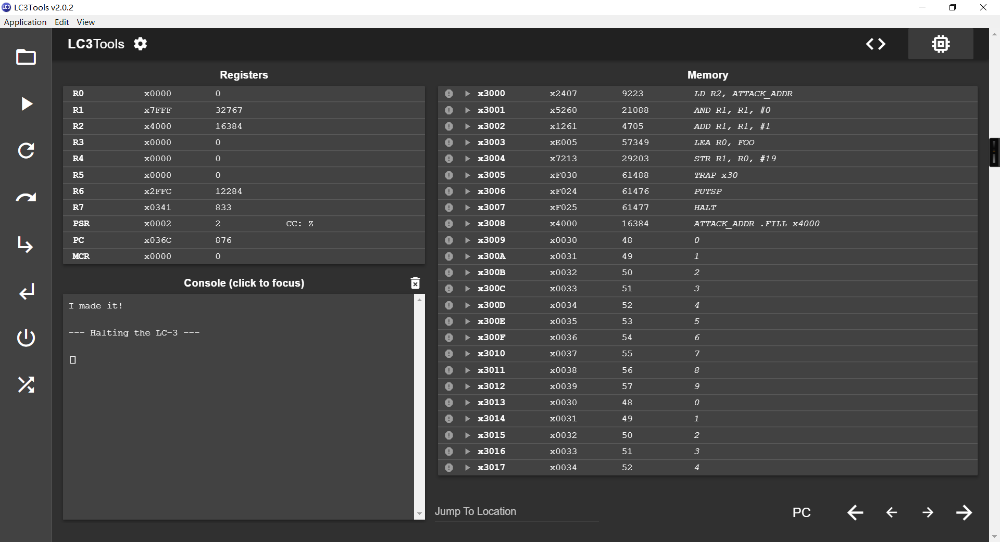

### Lab5

- 姓名：林佳胜；学号：PB24511997

---

> 源文件的注释还算详细。
>
> 实验报告的框架采用的是 **Lab1 - Lab3** 的。

#### 一. 简要描述

- **主函数(MAIN)：** 负责初始化字符串（消去 **.STRINGZ** 默认设置的 **‘\0’**），调用 **TRAP x30** 注入代码，并劫持 **PUTSP** 攻击。
- **TRAP x30** 服务历程对寄存器的保护，保证了 **R2** 中存储的恶意代码地址能够正确传递到 **PUTSP** 的执行时刻。
- **TSR_HIJACK(TARP x30)** 和 **ATTACK(.ORIG x4000 开始)** 的程序是预设代码，故不介绍了。  

#### 二. 实验结果

> 屏幕中输出 “I made it!” 表明实验成功。

- 

#### 三. 问题与解决

> 感觉本次实验挺成功的，基本没遇到什么问题。

- 如何较为方便的填充 20 个占位符？
    - 动态存储，先用 **.STRINGZ** 静态存储包含 **‘\0’** 在内的 20 个字符，然后用 **STR** 覆盖 **‘\0’**。
- 原设定程序有部分代码未正确执行，即 **TRAP x30** 的服务历程中，恢复寄存器指令不会被执行。
    - 通过调整标签 **LEAVE** 的位置，保证程序实现原先意图。